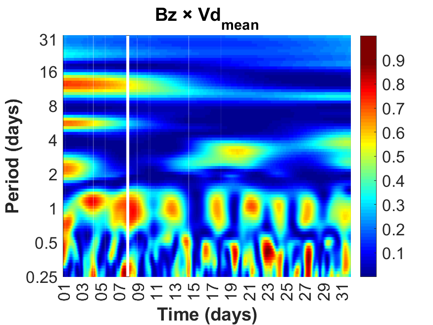
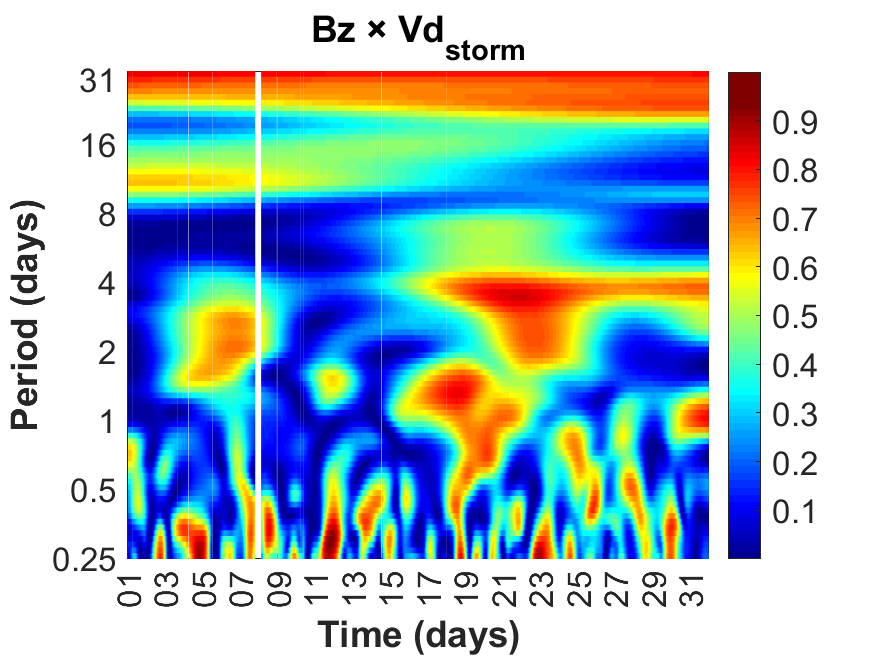
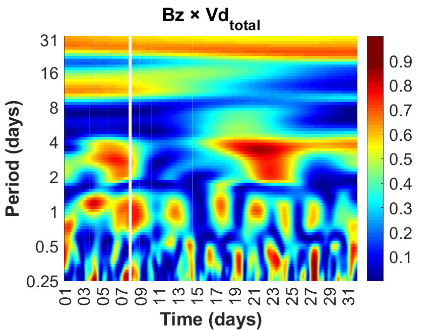
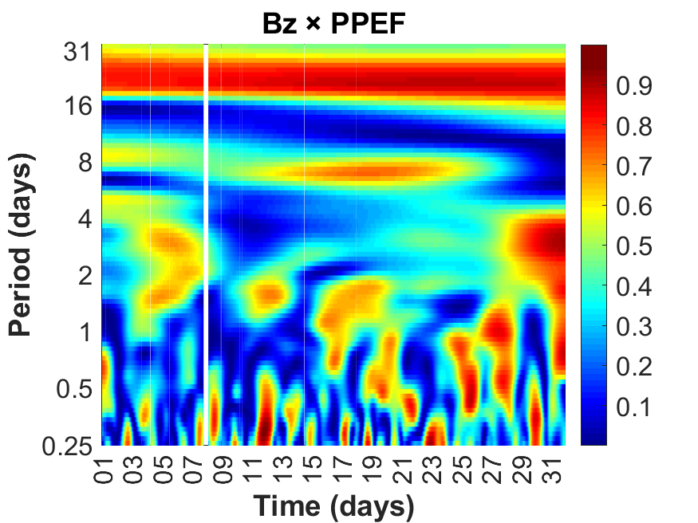
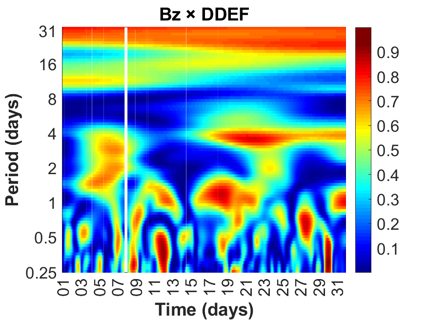

# 🌌 Coerência Wavelet Bz (OMNI) × Vd / PPEF / DDEF – Agosto 2017

Este repositório contém scripts MATLAB para calcular a **Coerência Wavelet Contínua (WCOH)** entre o **campo magnético Bz (OMNI)** e diferentes componentes do **drift ionosférico (Vd, PPEF e DDEF)** na estação **Araguatins (TO)** durante **agosto de 2017**.

O objetivo é investigar o acoplamento espectro-temporal entre o vento solar (Bz) e os drifts elétricos ionosféricos.

---

## 🛠 Tecnologias Usadas

- **MATLAB (R2019b ou superior)**
- **Wavelet Toolbox**
- Arquivos `.mat` com parâmetros ionosféricos (5 min)
- Arquivo `dados_Omni_Tratados.txt` com dados OMNI (5 min)
- Arquivo `drift.dat` com Vd, PPEF e DDEF (15 min)


---

## 📊 Dados Utilizados

- **Parâmetros OMNI (5 min)**: `Bz (nT)`  
- **Parâmetros ionosféricos / drift (15 min)**: `Vd_mean`, `Vd_storm`, `Vd_total`, `PPEF`, `DDEF`

💡 Objetivo

- Aplicar análise de **coerência wavelet contínua (WCOH)** para identificar padrões espectro-temporais e períodos dominantes entre o **campo magnético Bz** e os diferentes tipos de drifts elétricos na ionosfera durante **agosto de 2017**.

---

## 📂 Estrutura do Projeto

```bash
Wavelet_Coherence_Bz_vs_Fejer
├── dados/
│ ├── mediasionosfericasARG.mat
│ ├── dados_Omni_Tratados.txt
│ └── drift.dat
├── images/
│ ├── WCOH_Bz_Vd_mean.png
│ ├── WCOH_Bz_Vd_storm.png
│ ├── WCOH_Bz_Vd_total.png
│ ├── WCOH_Bz_PPEF.png
│ └── WCOH_Bz_DDEF.png
├── wav_bz_vd.m
└── README.md
```

---

## ⚙️ Como Executar

1. Clone o repositório:

```bash
git clone https://github.com/lauratrigo/Wavelet_Coherence_Bz_vs_Fejer.git
cd Wavelet_Coherence_Bz_vs_Fejer
```

2. Abra o MATLAB, certifique-se de que os arquivos `.mat`, `.txt` e `drift.dat` estão na pasta `dados/`.

3. Execute o script principal:

```matlab
run wav_bz_vd.m
```
Os gráficos serão salvos em images/.

---

## 📈 Gráficos Gerados

---

# Bz × Drift / Fejer Sinais

### Bz × Vd_mean
<div align="center">
  <h4><strong>Bz × Vd_{mean}</strong></h4>
  
</div>

### Bz × Vd_storm
<div align="center">
  <h4><strong>Bz × Vd_{storm}</strong></h4>
  
</div>

### Bz × Vd_total
<div align="center">
  <h4><strong>Bz × Vd_{total}</strong></h4>
  
</div>

### Bz × PPEF
<div align="center">
  <h4><strong>Bz × PPEF</strong></h4>
  
</div>

### Bz × DDEF
<div align="center">
  <h4><strong>Bz × DDEF</strong></h4>
  
</div>

---

## 🤝 Agradecimentos

Este projeto foi desenvolvido como parte de pesquisa em Física Espacial no IP&D/UNIVAP, com apoio do grupo de estudos em ionosfera e geomagnetismo.

## 📜 Licença

Este repositório está licenciado sob MIT License. Consulte o arquivo LICENSE para mais informações.
